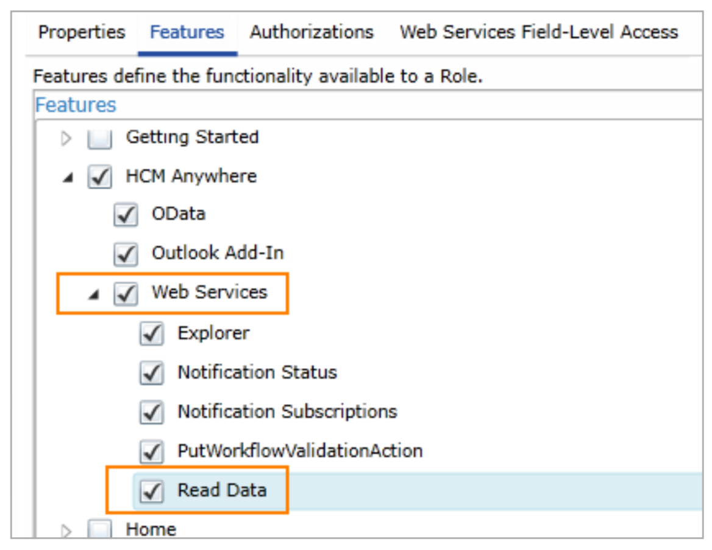

# tap-dayforce
[](https://badge.fury.io/py/tap-dayforce)
[](https://www.gnu.org/licenses/gpl-3.0)
[](https://pypi.python.org/pypi/ansicolortags/)
[](https://travis-ci.com/goodeggs/tap-dayforce.svg?branch=master)

A [Singer](https://www.singer.io/) tap for extracting data from the [Dayforce REST API v1](https://developers.dayforce.com/Build/RESTful-general-URL-structure.aspx).

## Installation

Since package dependencies tend to conflict between various taps and targets, Singer [recommends](https://github.com/singer-io/getting-started/blob/master/docs/RUNNING_AND_DEVELOPING.md#running-singer-with-python) installing taps and targets into their own isolated virtual environments:

### Install Dayforce Tap

```bash
$ python3 -m venv ~/.venvs/tap-dayforce
$ source ~/.venvs/tap-dayforce/bin/activate
$ pip3 install tap-dayforce
$ deactivate
```

### Install Stitch Target (optional)

```bash
$ python3 -m venv ~/.venvs/target-stitch
$ source ~/.venvs/target-stitch/bin/activate
$ pip3 install target-stitch
$ deactivate
```

## Configuration

The tap accepts a JSON-formatted configuration file as arguments. This configuration file has four required fields:

1. `username`: A valid Dayforce web services user account username.
2. `password`: A valid Dayforce web services user account password.
3. `client_name`: A valid client name (e.g. Company Name) that will be inserted into the request URL.
2. `email`: A valid email address to be inserted into the `From` header of the HTTP Request headers.

It's important to note that the Role attached to the User Account used in the configuration file must have at minimum the "Web Services" feature, as well as the "Read Data" sub-feature enabled:



An bare-bones Dayforce configuration may file may look like the following:

```json
{
  "username": "foo",
  "password": "bar",
  "client_name": "foo_bar",
  "email": "foo.bar@gmail.com"
}
```

Additionally, you may specify more granular configurations for individual streams. Each key under a stream should represent a valid API request parameter for that endpoint. A more fleshed-out configuration file may look similar to the following:

```json
{
  "username": "foo",
  "password": "bar",
  "client_name": "foo_bar",
  "email": "foo.bar@gmail.com",
  "streams": {
    "employees": {
      "expand": "EmploymentStatuses,Roles,EmployeeManagers,CompensationSummary,Locations,LastActiveManagers"
    },
    "employee_punches": {
      "filterTransactionStartTimeUTC": "2019-06-01T00:00:00Z"
    }
  }
}
```

## Streams

The current version of the tap syncs two distinct [Streams](https://github.com/singer-io/getting-started/blob/master/docs/SYNC_MODE.md#streams):
1. `Employees`: [Endpoint Documentation](https://developers.dayforce.com/Build/API-Explorer/Employee/GET-Employee-Details.aspx)
2. `EmployeePunches`: [Endpoint Documentation](https://developers.dayforce.com/Build/API-Explorer/Time-Management/Employee-Punches.aspx)

## Discovery

Singer taps describe the data that a stream supports via a [Discovery](https://github.com/singer-io/getting-started/blob/master/docs/DISCOVERY_MODE.md#discovery-mode) process. You can run the Dayforce tap in Discovery mode by passing the `--discover` flag at runtime:

```bash
$ ~/.venvs/tap-dayforce/bin/tap-dayforce --config=config/dayforce.config.json --discover
```

The tap will generate a [Catalog](https://github.com/singer-io/getting-started/blob/master/docs/DISCOVERY_MODE.md#the-catalog) to stdout. To pass the Catalog to a file instead, simply redirect it to a file:

```bash
$ ~/.venvs/tap-dayforce/bin/tap-dayforce --config=config/dayforce.config.json --discover > catalog.json
```

## Sync to stdout

Running a tap in [Sync mode](https://github.com/singer-io/getting-started/blob/master/docs/SYNC_MODE.md#sync-mode) will extract data from the various selected Streams. In order to run a tap in Sync mode and have messages emitted to stdout, pass a valid configuration file and catalog file:

```bash
$ ~/.venvs/tap-dayforce/bin/tap-dayforce --config=config/dayforce.config.json --catalog=catalog.json
```

The tap will emit occasional [Metric](https://github.com/singer-io/getting-started/blob/master/docs/SYNC_MODE.md#metric-messages), [Schema](https://github.com/singer-io/getting-started/blob/master/docs/SPEC.md#schema-message), [Record](https://github.com/singer-io/getting-started/blob/master/docs/SPEC.md#record-message), and [State messages](https://github.com/singer-io/getting-started/blob/master/docs/SPEC.md#state-message). You can persist State between runs by redirecting messages to a file:

```bash
$ ~/.venvs/tap-dayforce/bin/tap-dayforce --config=config/dayforce.config.json --catalog=catalog.json >> state.json
$ tail -1 state.json > state.json.tmp
$ mv state.json.tmp state.json
```

## Sync to Stitch

You can also send the output of the tap to [Stitch Data](https://www.stitchdata.com/) for loading into the data warehouse. To do this, first create a JSON-formatted configuration for Stitch. This configuration file has two required fields:
1. `client_id`: The ID associated with the Stitch Data account you'll be sending data to.
2. `token` The token associated with the specific [Import API integration](https://www.stitchdata.com/docs/integrations/import-api/) within the Stitch Data account.

An example configuration file will look as follows:

```json
{
  "client_id": 1234,
  "token": "foobarfoobar"
}
```

Once the configuration file is created, simply pipe the output of the tap to the Stitch Data target and supply the target with the newly created configuration file:

```bash
$ ~/.venvs/tap-dayforce/bin/tap-dayforce --config=config/dayforce.config.json --catalog=catalog.json --state=state.json | ~/.venvs/target-stitch/bin/target-stitch --config=config/stitch.config.json >> state.json
$ tail -1 state.json > state.json.tmp
$ mv state.json.tmp state.json
```

## Development
